# Fliphack V1

A custom, pocket-sized hardware multitool inspired by the Flipper Zero. Built to learn custom PCB design and integrate specific modules like GPS and long-range RF. Designed entirely from scratch in KiCad and Fusion 360.

### Assembly Preview
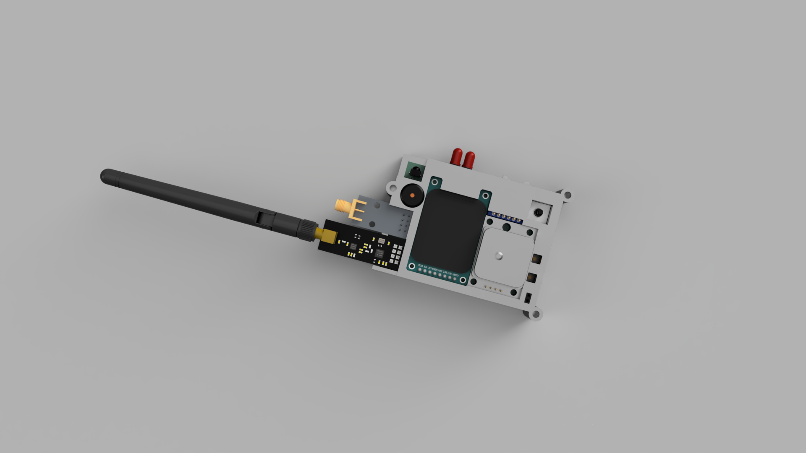

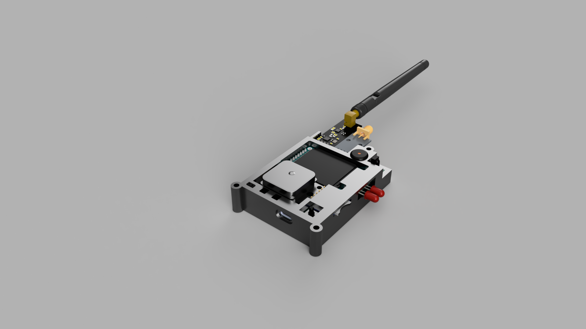

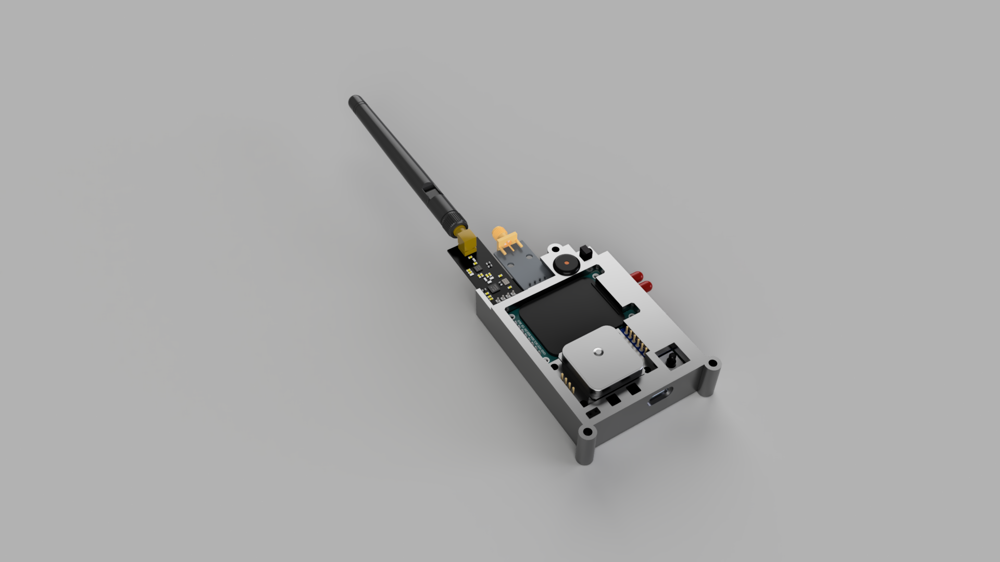

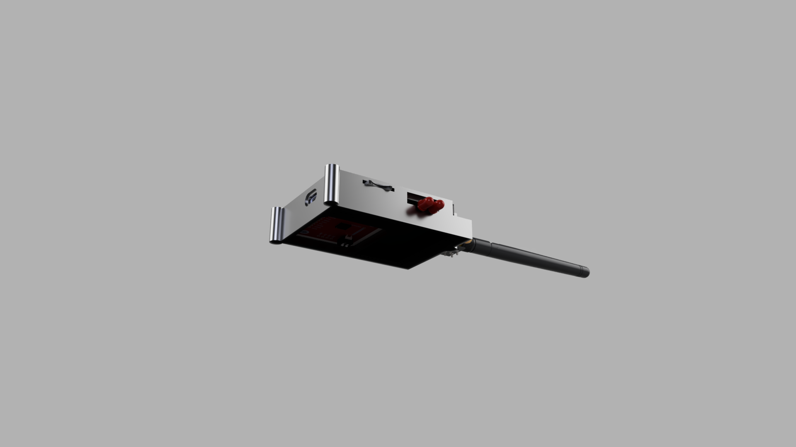

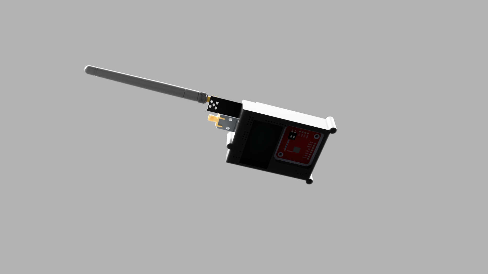

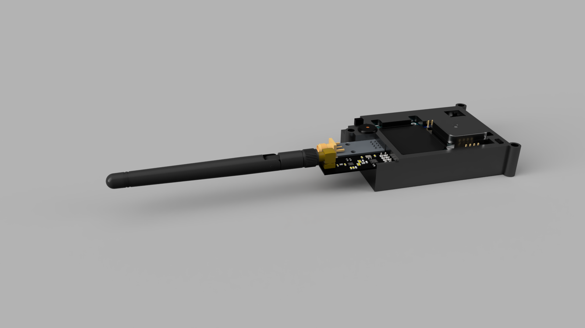

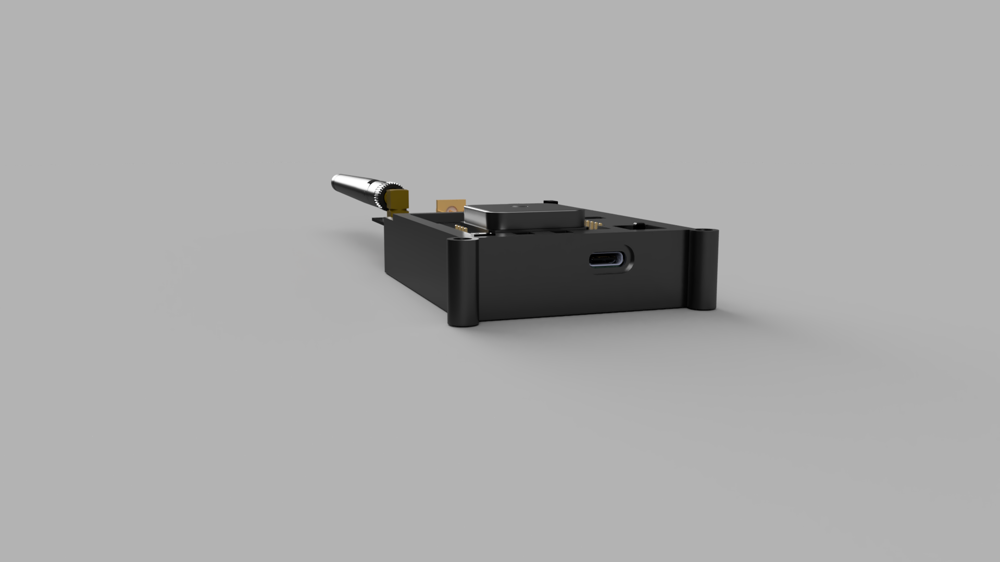

### 3D PCB Render
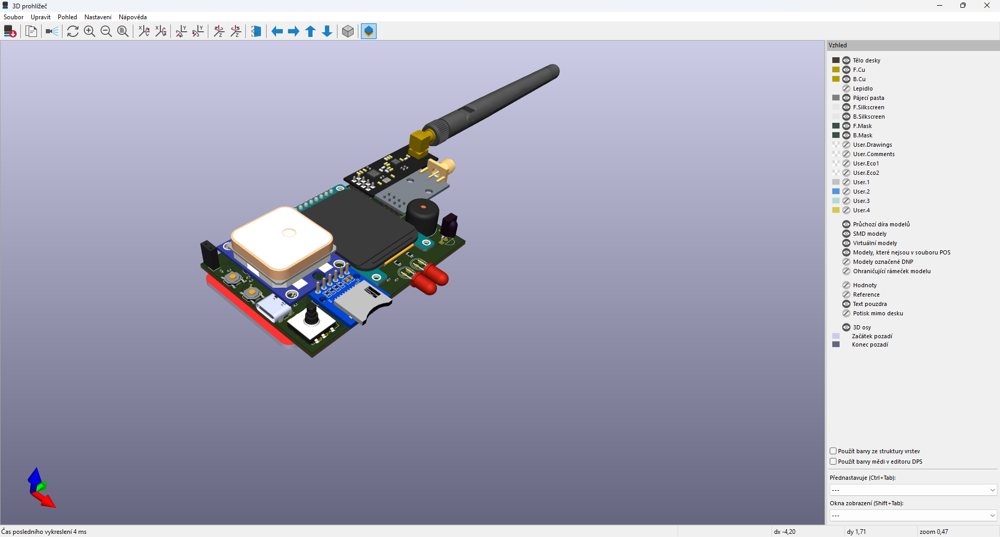

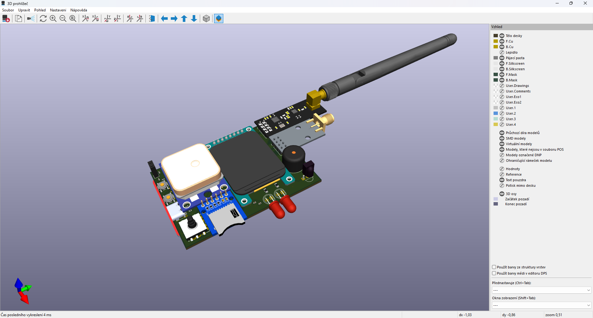

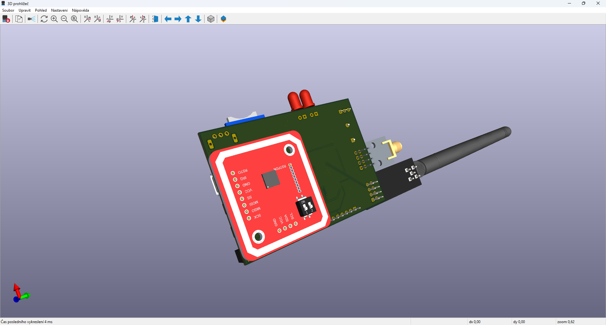

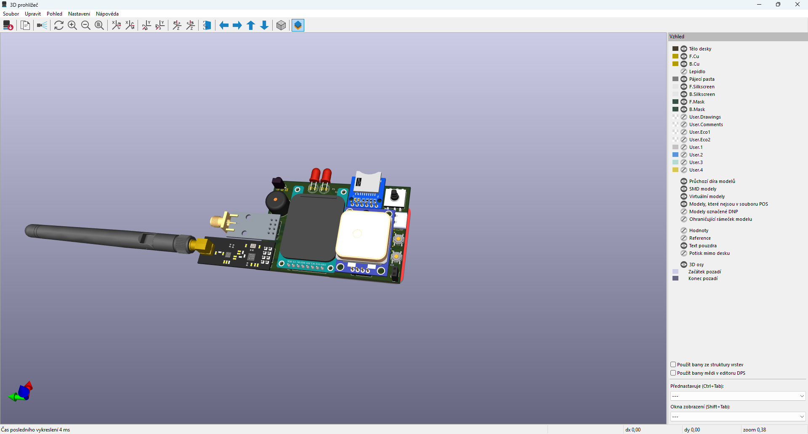

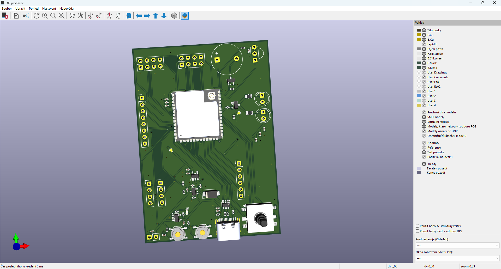

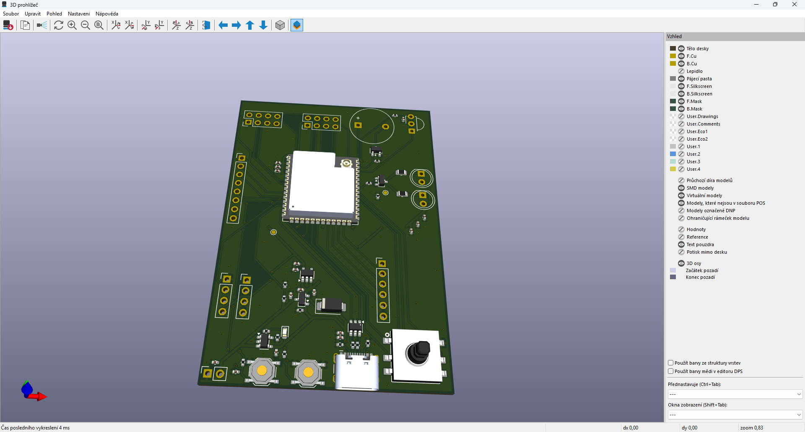

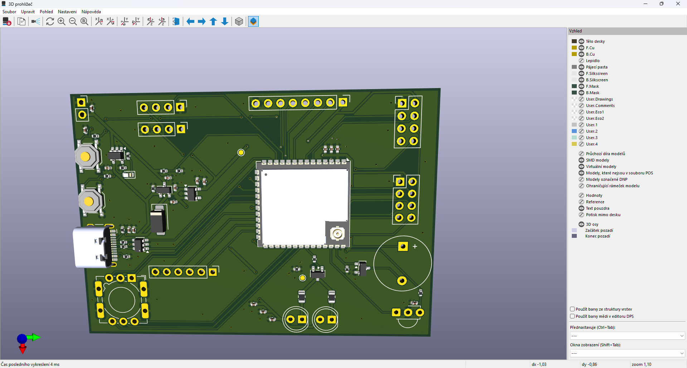

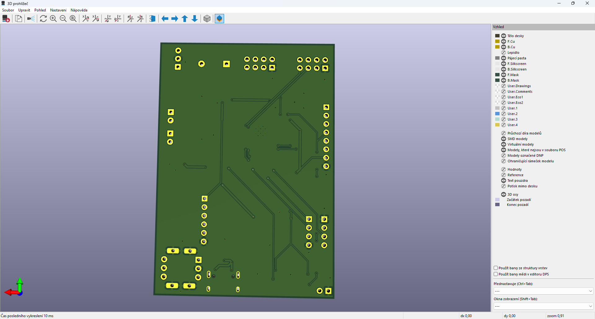

### PCB Routing
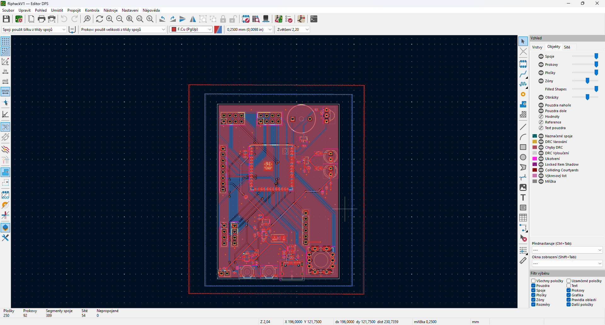

### Schematic
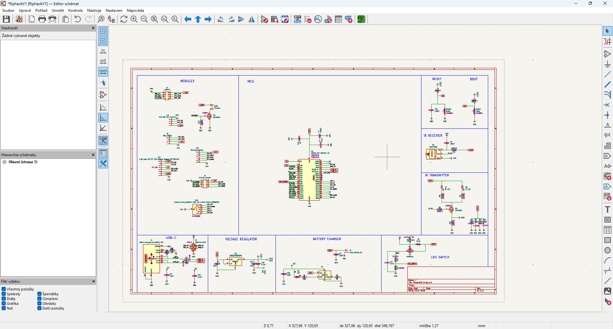

---

## Bill of Materials (BOM)

| Component | Qty | Description | LCSC Part # / Note |
| :--- | :---: | :--- | :--- |
| **ESP32-S3-WROOM-1U** | 1 | MCU (16MB Flash, 8MB PSRAM, U.FL connector) | N16R8 Version - included in JLCPCB assembly |
| **1.69" SPI Display** | 1 | LCD with ST7789 driver (240x280px) | SPI Interface https://a.aliexpress.com/_EwHjYqY| 
| **CC1101 Module** | 1 | Sub-GHz RF module (with SMA antenna) | E07-M1101D https://a.aliexpress.com/_Ey9DMVW |
| **nRF24L01+PA+LNA Module** | 1 | 2.4GHz RF module (Mouse Hijacking) | https://a.aliexpress.com/_Ew8TYLa  |
| **PN532 Module** | 1 | NFC/RFID 13.56MHz module | https://a.aliexpress.com/_ExXcsbE |
| **Neo-8M GPS Module** | 1 | GPS module with ceramic patch antenna | https://a.aliexpress.com/_EvsK2kc |
| **MicroSD Card Module** | 1 | For offline data logging | https://a.aliexpress.com/_EHdpg1A |
| **TSOP4838** | 1 | 38kHz Infrared Receiver | https://a.aliexpress.com/_EzLWQ5W |
| **Vishay TSAL6400** | 2 | 5mm 940nm THT Infrared LEDs (High power)|https://a.aliexpress.com/_EIPCbXW| | **Passive Piezzo Buzzer** | 1 | 12x9.5mm, RM7.6 OR smaller diameter, just make sure that the pins diameter is ok, otherwise you would have to add more solder
| **TS-1187A Buttons** | 5 | SMT Tactile Switches (3x6mm footprint) | **C318884** (Basic Part - included in JLCPCB assembly) |
| **LiPo Battery** | 1 | 3.7V 800mAh, Size: 802540 (8x25x40mm) |https://a.aliexpress.com/_EQnfApW |

### Mechanical & Assembly
| Item | Qty | Specification | Purpose |
| :--- | :---: | :--- | :--- |
| **M3 Heat-set Inserts** | 4 | Brass inserts (M3x3x4.2mm) | Case mounting |
| **M3 Screws** | 4 | M3x6mm (Button Head) | Enclosure assembly |
| **3D Printed Case** | 1 | Custom PLA/PETG Enclosure | Files in `3D_Models` |

---
